# ADLC — the automated development life cycle

One product spec, kept in git. A change is a diff to that spec. Agents carry the work between two points where a human decides, and every step is checked by something that did not do the work.

That's the whole idea. The rest of this file is the detail underneath it.

## The line

It's like a production line in a factory. Each station does one job. Between the stations sit guardrails that either pass the work on or send it back. People are not on the line. They stand at two points and make the two decisions that carry accountability.

```mermaid
flowchart LR
  ISSUE([issue opened]) --> TRIAGE[triage]

  TRIAGE -->|not actionable| CLOSED1([closed, with the reason])
  TRIAGE -->|bug| REPRO["reproduce<br/>(failing test = the bug is real)"]
  REPRO -->|not reproducible| CLOSED2([closed, reopenable])

  TRIAGE -->|feature / chore| DELTA["spec delta<br/>(Planner)"]
  REPRO -->|reproduced| DELTA
  DELTA --> SREV["spec review<br/>(advisory)"]
  SREV --> GATE1{{"Gate 1 · human<br/>APPROVES the spec PR"}}

  GATE1 --> BUILD["build<br/>(Executor, from the approved spec head)"]
  BUILD --> GATE["npm run verify<br/>(deterministic)"]
  GATE --> REVIEW["review<br/>(fresh context)"]
  REVIEW --> VERIF["verify vs spec<br/>(Verifier · independent)"]
  VERIF --> QUAL["quality<br/>(usability + accessibility)"]
  QUAL --> GATE2{{"Gate 2 · human<br/>merges each impl PR"}}
  GATE2 --> ARCHIVE["spec archived into openspec/specs/<br/>issue closed · state:shipped"]

  VERIF -.->|"MISMATCH · back to the Planner, not the Executor"| DELTA
  VERIF -.->|"out-of-scope findings"| ISSUE
  QUAL -.->|"out-of-scope findings"| ISSUE

  classDef gate fill:#ff454f22,stroke:#ff454f,stroke-width:2px;
  classDef check fill:#0000000d,stroke:#8a8f9a,stroke-dasharray:3 3;
  class GATE1,GATE2 gate;
  class GATE,SREV check;
```



The dotted arrows are the important part. A finding does not go into a report that someone reads later. It goes back to a station — and two of those arrows point all the way back to intake, which is the line feeding itself.

Note where the Verifier's failures go: **back to the Planner, not to the Executor.** If the spec was silent or wrong, more code will not fix it.

## The two gates — and why the spec merges last

**Gate 1 — approve the intent.** A human with write access submits an *approving review* on the spec PR, while it contains nothing but `openspec/changes/<slug>/`. An agent never approves a spec. The approval — not a merge — is what starts the build.

**Gate 2 — ship it.** A human merges each implementation PR, on green gates. The line opens implementation PRs. It never merges one.

The spec PR itself **stays open until the last implementation PR has merged**, and this is deliberate, for two reasons. First, one spec is the shared artifact of every implementation built from it — a single delta can fan out to an implementation PR per repo (web, mobile, api), each branched from the same approved spec head and each verified against it. Second, it keeps `main` honest: the living spec updates only when `openspec archive` folds the delta in after shipping, so **the spec on `main` only ever describes what the product actually does.** A spec that merges before its implementation is a promise; a spec that merges after is a record.

The mechanics fall out of git: the implementation branches from the spec branch, so the delta rides inside the implementation PR and lands on `main` at Gate 2; the archive step then folds it into `openspec/specs/` and the spec PR resolves. If a verifier mismatch sends the Planner back to revise the spec, the new commits dismiss the old approval — Gate 1 simply happens again, which is exactly right.

## Intake — anything in, one shape out

Work arrives from wherever people are: a chat message, a support ticket, a customer email, someone's idea in a meeting. The line accepts it exactly one way — as a GitHub issue — and everything after that is automatic while a credential secret is set (`ANTHROPIC_API_KEY` or `CLAUDE_CODE_OAUTH_TOKEN`). There is no label to remember, no command to run. Opening the issue is putting the part on the belt.

Triage is the first station, not a person's job, and it **fails closed**: an unparseable verdict parks the issue for a human rather than inventing work. Not-actionable issues close with the reason and reopen into the line if the reporter adds what was missing. A bug is only accepted once the reproduce station turns it into a **failing test** — a reproduction, not a model's opinion, is what makes a bug real. A bug that will not reproduce is *closed*, deliberately, with the full report and the `resolution:not-reproducible` label: open issues are only things actually moving down the line. Report it again and triage recognizes the recurrence, reopens the original with both reports attached, and two independent sightings become the evidence the first run lacked.

**Everything actionable is spec-driven — bugs included.** A bug's delta is small (the corrected behaviour as a scenario, evidenced by the failing test), but it passes the same Gate 1, because the question "what *should* this do" is a human's to answer no matter how the wrong behaviour was discovered.

## What each finding heals

Every check produces findings in the same shape, so the line can route them without a person reading a report.

| What was found | Goes to | Heals |
|---|---|---|
| A code review finding | back to the build, same cycle | the change |
| A Verifier finding — drift, or a gap in the spec | the Planner, then Gate 1 again | the spec |
| A confirmed defect outside the change's scope | intake, as a new `origin:adlc` issue | the product |
| A finding that keeps coming back | the prompts and the gate themselves | the line |

The second row is the one teams skip. When a reviewer says "the spec doesn't say which of these two rules wins," that is not a nuisance. It is the most valuable thing the run produced, and it belongs in the spec before the next person guesses.

The third row is bounded, because a line that feeds itself can also chase its own tail: machine-filed issues run at depth 1, and issues *they* would file park for a person. Every station's bounce-back is capped at two attempts; the third parks with a summary of everything tried. State for all of this lives on the issue — labels and a hidden links block — never in a runner, which is why any station can be re-run from the issue number alone.

## Three roles — two build it, one checks it

| Role | Stations | What it may not do |
|---|---|---|
| **Planner** | draft (and revise) the spec delta and per-surface tasks | write code |
| **Executor** | reproduce a bug · build an approved delta | renegotiate the spec |
| **Verifier** | verify the shipped behaviour against the spec | write code, or share a session with either of the above |
| Quality check | review · `npm run verify` · usability + accessibility | pass anything the deterministic gate failed |

**Isolation is the design principle.** Planner and Executor share the same business context but never a session, so a plan cannot leak its assumptions into the build. The Verifier shares neither — it re-derives the feature from the spec alone before it opens a single implementation file.

That last part is what stops it becoming a diff-reader. Read the code first and you end up checking whether the code is self-consistent, which it always is.

It also reports drift in **both** directions, which most reviews do not. *Missing* is a requirement the product does not honour. *Extra* is behaviour that traces back to no requirement — and that one matters more than it sounds, because code cannot abstain. Where the spec stayed silent, an implementation detail decided, and nobody chose it. Extra findings go back to the spec, not into the code.

This is not ceremony. It is the same reason a factory's quality inspector does not report to the line supervisor. An agent that just spent twenty minutes convincing itself a change was right is the worst possible reviewer of that change.

## What the gate is, and is not

```bash
npm run verify     # node --test  +  requirement coverage
```

No model in it. It runs in well under a second, and it is the only thing in the loop that gets a vote on whether the work is done.

It is also not enough on its own. `npm run req-coverage` checks that every requirement in the living spec is named by at least one test. A requirement still in flight in a delta may be named by a test but does not owe one until that delta's `tasks.md` is fully ticked — so a spec PR is not red merely for describing work nobody has built, and a build that claims to be finished without a test is. It cannot check whether that test asserts the right thing. A test written from the implementation agrees with the implementation, passes forever, and reports nothing.

Coverage is not proof. A green pipeline is only as true as the thing it compares against — which is exactly the gap the Verifier exists to close, and why it is a different thing from the gate.

## Quality — don't make me think

The last guardrail before Gate 2 asks the user's questions rather than the spec's. The deterministic half is Lighthouse accessibility and performance scores against thresholds with a vote — a breach fails the check. The agentic half is the pass a scanner cannot do: is the first click obvious, do controls say what they do in the user's units, does the page say what just happened — including the empty and error states — and can a keyboard user actually get around. In-scope findings land on the PR for the human at Gate 2; everything else files as an issue and re-enters the line.

## Any agent, on purpose

`AGENTS.md` holds the standards. `CLAUDE.md`, `GEMINI.md`, `.cursor/rules/` and `copilot-instructions.md` are pointers to it. One file to change, every tool reads it, no drift.

The stations are plain-markdown prompts in `prompts/`. CI pins one CLI for reproducible runs, in exactly one file (`scripts/run-station.sh`); locally, `./run.sh prompts/<name>.md [target]` dispatches to whichever CLI you have, and `--print` gives you the text to paste anywhere. Nothing in the loop depends on a particular vendor, because the parts that matter are the spec, the gate, and the independence.

## What's real here, and what an org-scale system adds

Real in this repo: the spec as source of truth, the deterministic gate, one prompt per station with fresh context, both human gates, the full unattended line in `.github/workflows/`, and the adoption kit (`.github/workflows/callers/`) that runs the same stations in any repo from a pinned tag.

What an org-scale deployment adds on top — and what the internal system this is modelled on does add: a GitHub App instead of the repo token, so stations work across an organization; a central hub repo holding secrets and model routing; real preview deploys instead of an app started in the runner; a pipeline dashboard instead of labels; browser-fleet e2e and security review as additional hard gates; a `design.md` contract check for changes that span services. Every one of those is the same station, scaled — none of them changes the shape of the line.

Two stations from the wider model are **deliberately absent, not forgotten**: a security review (which belongs beside the deterministic gate as a hard gate in any real deployment) and the contract-binding `design.md` check (with one service and one surface, there is nothing for two components to disagree about). Both would be the first things to add on a real codebase. Neither is pretended at here.

The honest limit: none of this makes an agent reliable. It makes an unreliable agent's output checkable, and it makes the two decisions that matter land on a person who can be held to them.
