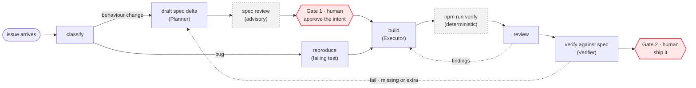

# ADLC — the automated development life cycle

One product spec, kept in git. A change is a diff to that spec. Agents carry the work between two points where a human decides, and every step is checked by something that did not do the work.

That's the whole idea. The rest of this file is the detail underneath it.

## The line

It's like a production line in a factory. Each station does one job. Between the stations sit guardrails that either pass the work on or send it back. People are not on the line. They stand at two points and make the two decisions that carry accountability.



The dotted arrows are the important part. A finding does not go into a report that someone reads later. It goes back to a station.

Note where the Verifier's failures go: **back to the Planner, not to the Executor.** If the spec was silent or wrong, more code will not fix it.

## The two gates

**Gate 1 — approve the intent.** A human reads and merges the spec delta. An agent never approves a spec. Merging the delta *is* the approval, so the record of what was agreed is the same file the build reads.

**Gate 2 — ship it.** A human merges the pull request, on green gates.

Everything between the two is the agent's to run. That includes the review, which is why the review has to be independent.

## Intake — anything in, one shape out

Work arrives from wherever people are: a chat message, a support ticket, a customer email, someone's idea in a meeting. The line accepts it only one way, as a tracked issue.

In this repo that's the `issues/` directory. Three real ones ship with it, and they are deliberately different shapes: a bug with a clear symptom, a report about a surface this system does not own, and a product request that changes behaviour.

Classification is the first station, not a human's job. The routing question is one sentence: **would a rebuild from the spec alone lose this change?** If yes, the spec moves first. If no, it's code-only.

## What each defect heals

Every check produces findings in the same shape, so the line can route them without a person reading a report.

| What was found | Goes to | Heals |
|---|---|---|
| A reviewer or verifier finding | back to the build step, same cycle | the change |
| A gap, ambiguity, or conflict in the spec | a spec delta, through Gate 1 | the spec |
| Something a user hit in production | the same intake, as a new issue | the product |
| A finding that keeps coming back | the prompts and the gate themselves | the line |

The second row is the one teams skip. When a reviewer says "the spec doesn't say which of these two rules wins," that is not a nuisance. It is the most valuable thing the run produced, and it belongs in the spec before the next person guesses.

That row is not hypothetical here. Run `prompts/review.md` on the fix in `artifacts/expected/` and the reviewer finds exactly that gap between `REQ-ORD-2` and `REQ-ORD-3`.

## Three roles — two build it, one checks it

Four names over eight prompt files. The names matter less than the boundary between them.

| Role | Stations | What it may not do |
|---|---|---|
| **Planner** | classify, then draft the spec delta and the per-surface tasks | write code |
| **Executor** | build an approved delta · or reproduce and fix a bug | renegotiate the spec |
| **Verifier** | verify against the spec | write code, or share a session with either of the above |
| Quality check | review, plus `npm run verify` | pass anything the deterministic gate failed |

**Isolation is the design principle.** Planner and Executor share the same business context but never a session, so a plan cannot leak its assumptions into the build. The Verifier shares neither — it re-derives the feature from the spec alone before it opens a single implementation file.

That last part is what stops it becoming a diff-reader. Read the code first and you end up checking whether the code is self-consistent, which it always is.

It also reports drift in **both** directions, which most reviews do not. *Missing* is a requirement the product does not honour. *Extra* is behaviour that traces back to no requirement — and that one matters more than it sounds, because code cannot abstain. Where the spec stayed silent, an implementation detail decided, and nobody chose it. Extra findings go back to the spec, not into the code.

This is not ceremony. It is the same reason a factory's quality inspector does not report to the line supervisor. An agent that just spent twenty minutes convincing itself a change was right is the worst possible reviewer of that change.

The repo has a concrete demonstration. `artifacts/expected/` holds two reviews of two different fixes for the same bug. Both fixes pass all 17 tests. One review says `APPROVE`, the other says `REQUEST CHANGES`. The deterministic gate could not tell them apart. The independent reviewer could.

## What the gate is, and is not

```bash
npm run verify     # node --test  +  requirement coverage
```

No model in it. It runs in about a tenth of a second, and it is the only thing in the loop that gets a vote on whether the work is done.

It is also not enough on its own, and the repo proves it. `npm run req-coverage` checks that every requirement in `spec/` is named by at least one test. It cannot check whether that test asserts the right thing. `REQ-CAT-3` has a passing test, full coverage, a green pipeline, and behaviour that is plainly wrong.

Coverage is not proof. A green pipeline is only as true as the thing it compares against.

## The repo

```
adlc/
├── AGENTS.md              the only instruction file — the standards live here
├── CLAUDE.md              ┐
├── GEMINI.md              ├ three-line pointers to AGENTS.md, so nothing drifts
├── .cursor/rules/         │
├── .github/               ┘ copilot-instructions.md + the workflows
│
├── spec/                  the source of truth
│   ├── catalog.md          REQ-CAT-1..3, with WHEN/THEN scenarios
│   ├── orders.md           REQ-ORD-1..6
│   └── changes/            spec deltas — a behaviour change starts here
│
├── issues/                intake. Anything in, one shape out.
│
├── prompts/               one per station, plain markdown, no tool lock-in
│   ├── triage.md           classify — which path does this change take
│   ├── delta.md            draft the spec change      ┐ the feature path,
│   ├── spec-review.md      advisory review for Gate 1 ├ before any code
│   ├── build.md            build an approved delta    ┘ exists
│   ├── reproduce.md        write the failing test     ┐ the bug path,
│   ├── fix.md              make it pass               ┘ no delta needed
│   ├── review.md           check the change, fresh context
│   └── verify.md           spec vs code, independent
│
├── app/                   the product. ~170 lines, no dependencies.
├── test/                  every test names its requirement
├── scripts/               req-coverage.mjs — the deterministic half of the gate
│
├── artifacts/             real runs, committed. Not written by hand.
│   ├── expected/           one reference run per exercise
│   ├── gate-1/             spec deltas waiting on a human
│   └── unattended/         three issues in, three different endings, nobody steering
│
├── check.sh               pre-flight: Node, the gate, which CLI you have
└── run.sh                 ./run.sh prompts/fix.md — dispatches to your CLI
```

Four things and nothing else: what the product should do (`spec/`), what it does (`app/`, `test/`), how each step is carried out (`prompts/`), and the standards all of them answer to (`AGENTS.md`).

## Any agent, on purpose

`AGENTS.md` holds the standards. The other four instruction files are pointers to it. One file to change, four tools that read it, no drift between them.

The prompts are plain markdown. `run.sh` finds whichever CLI you have and pipes the prompt to it. If your tool isn't covered, `./run.sh --print prompts/fix.md` gives you the text to paste, and you lose nothing. Nothing in the loop depends on a particular vendor, because the parts that matter are the spec, the gate, and the independence.

## What's real here, and what a real system adds

Real in this repo: the spec as source of truth, the deterministic gate, one prompt per station with fresh context, both human gates, and the committed evidence of actual runs.

Missing on purpose, so the repo stays readable in an afternoon: a browser-level test layer, a database, a design system the generated UI is forced onto, business rules held outside the model's reach, and the CI wiring that runs all of this unattended. `.github/workflows/` shows the shape of that last one without the credentials to run it.

Two stations from the wider model are **deliberately absent, not forgotten**. There is no **security review**, which belongs as a hard gate alongside the deterministic one in any real deployment — `review.md` is a code reviewer and nothing more. And a delta here carries `proposal.md`, `spec.md` and `tasks.md`, but no **`design.md`** binding contract; with one service and one surface there is nothing for two components to disagree about, so the Verifier has no contract-mismatch check either. Both would be the first things to add on a real codebase. Neither is pretended at here.

The honest limit: none of this makes an agent reliable. It makes an unreliable agent's output checkable, and it makes the two decisions that matter land on a person who can be held to them.
