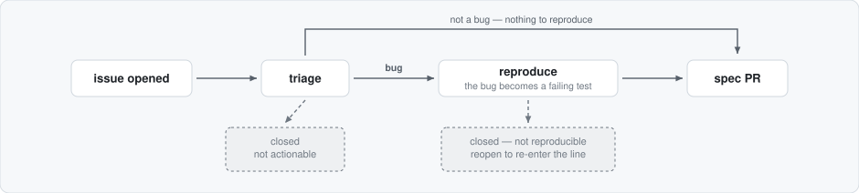
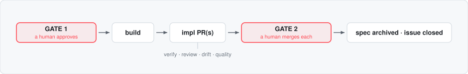

# ADLC — the automated development life cycle

An **assembly line for software development**, built from GitHub issues, GitHub Actions, [OpenSpec](https://github.com/Fission-AI/OpenSpec), and [buildwright](https://github.com/raunakkathuria/buildwright): an issue goes in, a verified pull request comes out, and exactly two human decisions happen in between.

This repo is both the line itself — six reusable workflows any repository can adopt — and its own first consumer: a small storefront (catalog and orders, in memory, zero dependencies) that ships through the line it demonstrates. Its issues, PRs, and Actions history are the living proof.

**Anything in, one shape out.** Work arrives as a GitHub issue and triage decides what it is. A bug is accepted only once the reproduce station turns it into a failing test — a reproduction, not a model's opinion, is what makes a bug real. Anything that is not a bug has nothing to reproduce. Either way, what leaves is a spec delta.



**Approved intent in, verified code out.** Gate 1 is an approving review on that spec PR, and the approval, not a merge, is what starts the build.



Everything between the two gates is automated. Every check is run by something that did not do the work. And the line never merges an implementation PR — **Gate 2 is a person, always.**

## The idea in four sentences

**The spec is the source of truth**, kept in git (`openspec/specs/`); if the code and the spec disagree, the code is wrong. **Every change is a spec delta** — bugs included — proposed as a spec PR that a human approves at Gate 1 but that **merges last**, only after every implementation PR built from it has merged, so `main`'s spec only ever describes what shipped. **Every guardrail is independent**: the deterministic gate has no model in it, the reviewer never wrote the code, and the Verifier re-derives expected behaviour from the spec before reading a line of the implementation — that is what catches feature drift. **Findings route, they don't rot**: a verifier mismatch goes back to the Planner, a quality finding outside the change becomes a new issue that re-enters the line at triage.

## See it run

The line is **off** unless the repo has a credential: either an `ANTHROPIC_API_KEY` Actions secret, or a `CLAUDE_CODE_OAUTH_TOKEN` from `claude setup-token` if you are on a Claude subscription. The demo runs on Claude keys because CI pins one CLI, but the line is not tied to one model: point it at any Anthropic-compatible gateway, such as LiteLLM fronting OpenAI, Gemini or Bedrock, and the prompts and workflows do not change ([docs/any-model.md](docs/any-model.md)). Without one, every workflow runs, explains itself, and stops. That is the whole switch: a repo that can open PRs on its own should require a human to turn it on.

With a credential set, open an issue and watch the labels move: `state:triaging → state:spec-draft → state:gate-1` — then approve the spec PR (Gate 1) and follow it through `state:building → state:verifying → state:quality → state:gate-2`. Merge the implementation PR (Gate 2) and the spec archives itself, the issue closes, and the label reads `state:shipped`. The issue list *is* the factory floor.

Want the product first? `npm start`, then http://localhost:3000. The gate is `npm run verify` — tests plus requirement coverage, deterministic, under a second, no model in it.

## The stations

| Station | Workflow | Trigger | What it does |
|---|---|---|---|
| Intake | [`intake.yml`](.github/workflows/intake.yml) | issue opened / reopened | triage (fail-closed) → not actionable is closed with the reason; a bug goes to **reproduce**, which writes the failing test that makes it real — or closes it as not-reproducible, reopenable |
| Spec | [`spec.yml`](.github/workflows/spec.yml) | dispatched by intake · by the verifier, for a revision · or `/revise` on the issue | the **Planner** drafts `openspec/changes/<slug>/`, opens the spec PR, two advisory review lenses comment |
| **Gate 1** | — | a human **approves** the spec PR | approval, not merge — the branch stays open as the shared artifact |
| Build | [`build.yml`](.github/workflows/build.yml) | the approving review | the **Executor** branches from the approved spec head, tests first, ticks `tasks.md`, opens the implementation PR after the gate is green; a fresh-context review lands in the PR body |
| Verifier | [`verifier.yml`](.github/workflows/verifier.yml) | dispatched by build | the independent drift check: re-derives from the spec, walks every scenario against the **running app**, reports `missing` and `extra`, verdict trailers `SPEC-MATCH` / `FEATURE-IMPLEMENTED`; mismatch routes to the **Planner** |
| Quality | [`quality.yml`](.github/workflows/quality.yml) | dispatched by verifier · nightly · on demand | Lighthouse accessibility + performance against thresholds, then the agentic pass a scanner cannot do — "don't make me think" usability and accessibility judgment |
| **Gate 2** | — | a human **merges** each implementation PR | on green checks and the two reports; nothing else merges one, ever |
| Finalize | [`finalize.yml`](.github/workflows/finalize.yml) | implementation PR merged | when every linked implementation is merged: `openspec archive` folds the delta into the living spec, the spec PR resolves, the issue closes |

Each station is one plain-markdown prompt in [`prompts/`](prompts/) with a fresh context — run any of them locally with `./run.sh prompts/<name>.md [target]`, with whichever agent CLI you have. CI pins Claude Code; the prompts have no vendor in them.

Three properties do most of the work:

- **The links block.** Each station records where the work went as a hidden, machine-readable comment on the source issue (`scripts/links.mjs` — spec PR, OpenSpec change, every implementation PR). Every later station starts from the issue alone, which is also why one spec PR can fan out to implementation PRs in several repos.
- **Labels are the dashboard.** Written only by the line: one `state:*` at a time, `type:*` from triage, `needs-human` when parked, `origin:adlc` on issues the line filed itself.
- **Loop caps.** A station's findings can bounce work back twice; the third failure parks the issue with a summary of every attempt. Machine-filed issues run the line at depth 1 — issues *they* would file wait for a person. Constants, not configuration ([`scripts/attempts.mjs`](scripts/attempts.mjs)).

## Adopt it in your repo

Copy the six thin callers from [`.github/workflows/callers/`](.github/workflows/callers/) into your repo's `.github/workflows/`, add one credential secret — `ANTHROPIC_API_KEY` or `CLAUDE_CODE_OAUTH_TOKEN` — run `openspec init` (`npm i -g @fission-ai/openspec`, or `npx @fission-ai/openspec init`), and give the line a deterministic `npm run verify`. Two callers need to know how to start your app: set `start_command` and `health_url` on **verifier** and **quality**, since the defaults are this repo's own app. That's the whole setup — the callers run these stations at a pinned tag, so you own no workflow logic and upgrade by bumping `@v1`. Details and the recommended branch-protection settings: [callers/README.md](.github/workflows/callers/README.md).

Security posture, since the line runs agents over text strangers wrote: issue bodies are handled as files, never interpolated into shell; agent steps run with allowlisted tools; every job has least-privilege permissions and a timeout; triage fails closed; and both accountable decisions belong to humans with write access — an approval from a drive-by account does not start a build.

## What this is not

None of this makes an agent reliable. It makes an unreliable agent's output **checkable**, and it puts the two decisions that carry accountability in front of a person who can be held to them. When the line is wrong, the wrongness lands somewhere a person can see it: a red gate, a review that objects, a MISMATCH verdict, a parked issue that says what it tried.

## The parts

```
openspec/           the living spec (specs/) and deltas in flight (changes/, on spec branches)
prompts/            one markdown file per station — the single definition, CLI-agnostic
scripts/            links.mjs · labels.mjs · attempts.mjs · file-findings.mjs · req-coverage.mjs · req-ids.mjs · lint-workflows.mjs
.github/workflows/  the six stations + verify.yml (the gate) · callers/ = the adoption kit
.buildwright/       the engineering discipline the Executor works to (KISS · YAGNI · DRY · TDD)
app/  test/         the storefront and its tests — the product that ships through the line
issues/             the three seed reports as files — how a station runs with no GitHub token
AGENTS.md           the standards; CLAUDE.md, GEMINI.md, cursor/copilot files point here
docs/               the design · running the line on another model · the org-scale map
```

For the full reasoning — why the spec merges last, why the Verifier reports drift in both directions, what was deliberately left out — read [CONCEPT.md](CONCEPT.md) and [docs/design.md](docs/design.md).
